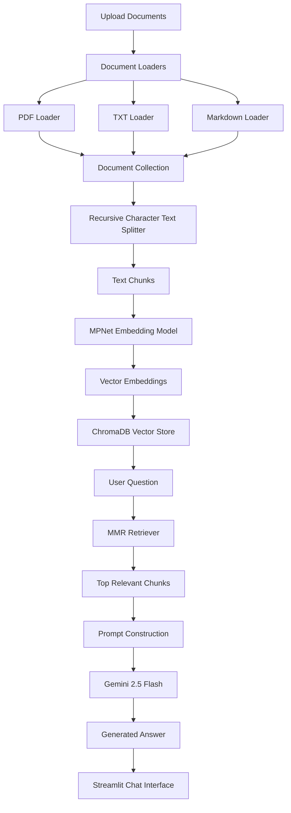
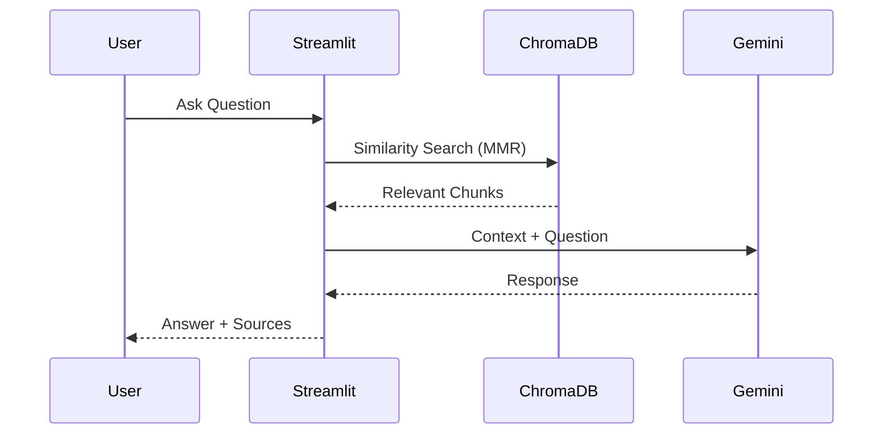

# 📚 NoteGPT

WEBSITE : https://notegpt-7cxl.onrender.com/

An AI-powered Retrieval-Augmented Generation (RAG) application that allows users to upload PDFs, notes, research papers, and study materials, then interact with them through natural language conversations.

Built using **Streamlit**, **LangChain**, **Google Gemini 2.5 Flash**, **ChromaDB**, and **Sentence Transformers**.

---

## 🚀 Features

### Document Processing

* Upload multiple PDF, TXT, and Markdown files
* Automatic text extraction
* Intelligent document chunking
* Persistent vector database storage

### Semantic Search

* Dense vector embeddings using MPNet
* ChromaDB vector store
* Maximum Marginal Relevance (MMR) retrieval
* Context-aware document retrieval

### AI Question Answering

* Powered by Gemini 2.5 Flash
* Answers grounded in uploaded documents
* Hallucination reduction through retrieval augmentation
* Multi-document reasoning

### User Interface

* Modern Streamlit dashboard
* ChatGPT-style conversation interface
* Knowledge base management
* Retrieved source inspection

---

# 🏗️ System Architecture



---

# 🔄 Query Workflow



---

# 📂 Project Structure

```text
NoteGPT/
│
├── app.py
├── create_database.py
├── requirements.txt
├── .gitignore
│
├── chroma_db/
│   ├── chroma.sqlite3
│   └── ...
│
├── uploads/
│
└── README.md
```

---

# ⚙️ Tech Stack

| Category        | Technology                       |
| --------------- | -------------------------------- |
| Frontend        | Streamlit                        |
| LLM             | Gemini 2.5 Flash                 |
| Framework       | LangChain                        |
| Vector Database | ChromaDB                         |
| Embeddings      | all-mpnet-base-v2                |
| Retrieval       | Maximum Marginal Relevance (MMR) |
| Language        | Python                           |

---

# 🧠 RAG Pipeline

## Step 1: Document Ingestion

Supported formats:

* PDF
* TXT
* Markdown

Documents are loaded using LangChain document loaders.

---

## Step 2: Chunking

Documents are split using:

```python
chunk_size = 1000
chunk_overlap = 200
```

Benefits:

* Preserves context
* Improves retrieval quality
* Reduces token wastage

---

## Step 3: Embedding Generation

Embedding model:

```text
sentence-transformers/all-mpnet-base-v2
```

Characteristics:

* 768-dimensional embeddings
* Strong semantic understanding
* State-of-the-art retrieval performance

---

## Step 4: Vector Storage

Generated embeddings are stored in:

```text
ChromaDB
```

Benefits:

* Fast similarity search
* Persistent storage
* Lightweight deployment

---

## Step 5: Retrieval

Retriever configuration:

```python
search_type="mmr"

k=5
fetch_k=12
lambda_mult=0.5
```

MMR balances:

* Relevance
* Diversity

This prevents returning nearly identical chunks.

---

## Step 6: Answer Generation

Retrieved chunks are injected into a prompt:

```text
Context + User Question
```

Gemini generates answers strictly from the supplied context.

If information is unavailable:

```text
I could not find this information in the uploaded documents.
```

---

# 📊 System Statistics

| Metric               | Value             |
| -------------------- | ----------------- |
| Embedding Model      | all-mpnet-base-v2 |
| Embedding Dimensions | 768               |
| Chunk Size           | 1000              |
| Chunk Overlap        | 200               |
| Retriever Type       | MMR               |
| Retrieved Chunks     | 5                 |
| Candidate Chunks     | 12                |
| LLM                  | Gemini 2.5 Flash  |
| Vector Store         | ChromaDB          |

---

# 📈 Performance Characteristics

### Fast Retrieval

* Vector search complexity significantly lower than full document search
* Suitable for thousands of chunks

### Reduced Hallucination

* Answers grounded in retrieved documents
* Explicit fallback response for missing information

### Scalability

Supports:

* Research papers
* Course notes
* Technical documentation
* Knowledge bases
* Academic material

---

# 🛠️ Installation

Clone repository:

```bash
git clone https://github.com/yourusername/NoteGPT.git

cd NoteGPT
```

Install dependencies:

```bash
pip install -r requirements.txt
```

Create environment file:

```text
GOOGLE_API_KEY=your_api_key
```

Run application:

```bash
streamlit run app.py
```

---

# 🎯 Example Use Cases

### Students

* Query lecture notes
* Search study material
* Summarize concepts

### Researchers

* Explore research papers
* Extract findings
* Compare methodologies

### Professionals

* Search documentation
* Build internal knowledge assistants
* Interact with reports

---

# Future Improvements

* Conversation memory
* Hybrid search (BM25 + Vector Search)
* Citation highlighting
* Multi-modal document support
* OCR for scanned PDFs
* User authentication
* Cloud vector databases
* Streaming responses

---

# Author

**Sagnick Paul**

Electrical Engineering Undergraduate
Jadavpur University

---

## License

MIT License
